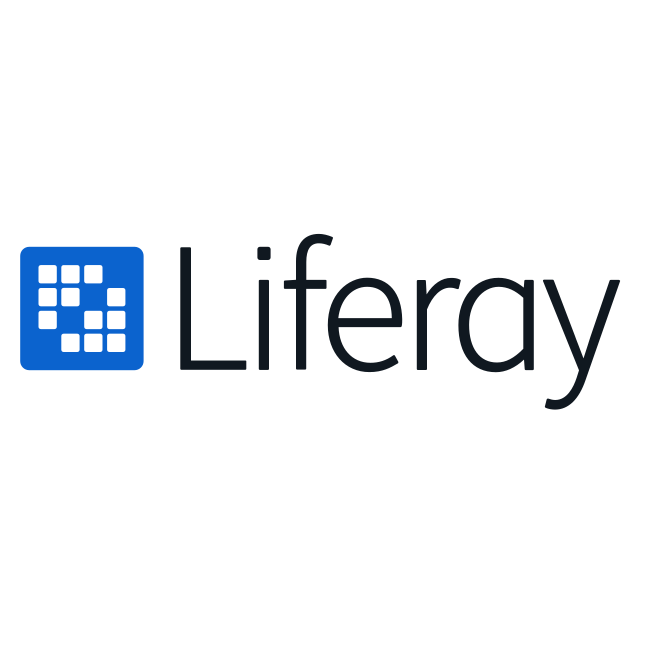

### Hi there, I'm Muhamad Hendri Febriansyah 👋

- 👨🏽‍💻 I’m currently developing apps
- 🌱 I’m currently learning flutter ~✨
- 🤔 My interests are in kotlin, flutter and laravel
- 📫 You can reach me at [email](mailto:hendrifebriansyah28@gmail.com)

## ❤ Connect with me
[][twitter]
[][linkedin]
[][instagram]
 

## ⚙️ Github Stats

  
  

## 🔥 Technologies & Tools

  
  
  
  
  
  
  
  
  
  
  
  
  
  
  
  
  

[twitter]: https://twitter.com/hendrifbs
[instagram]: https://instagram.com/hendrifbs
[linkedin]: https://www.linkedin.com/in/m-hendri-febriansyah/